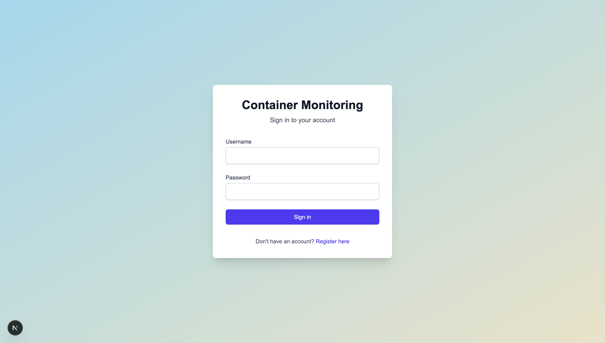
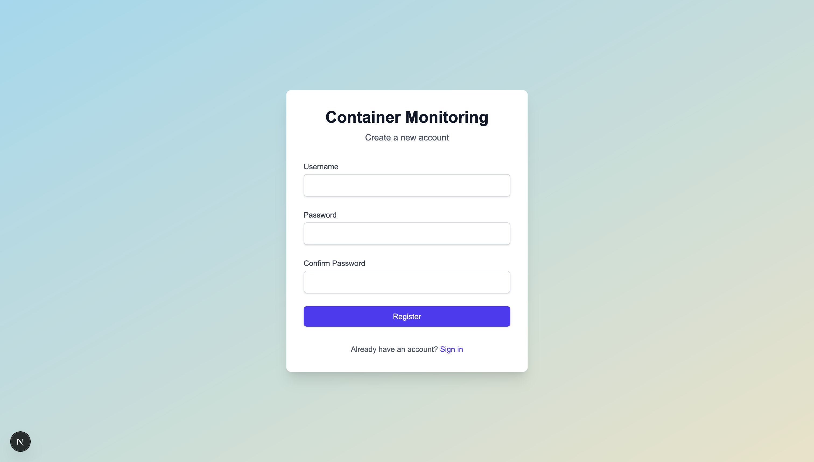
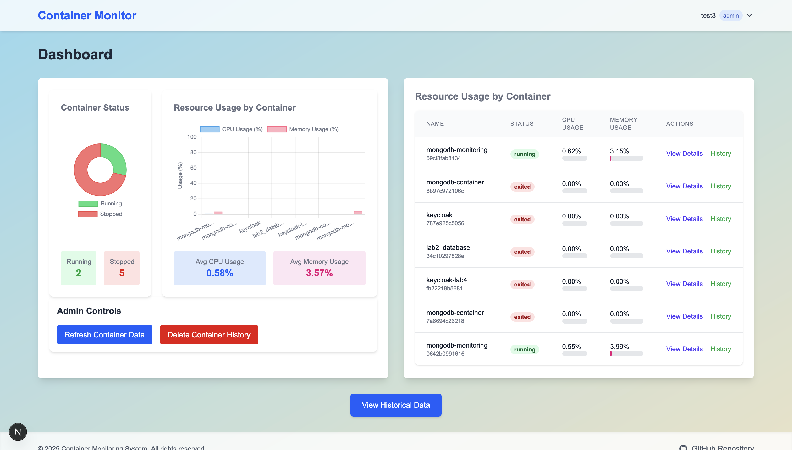
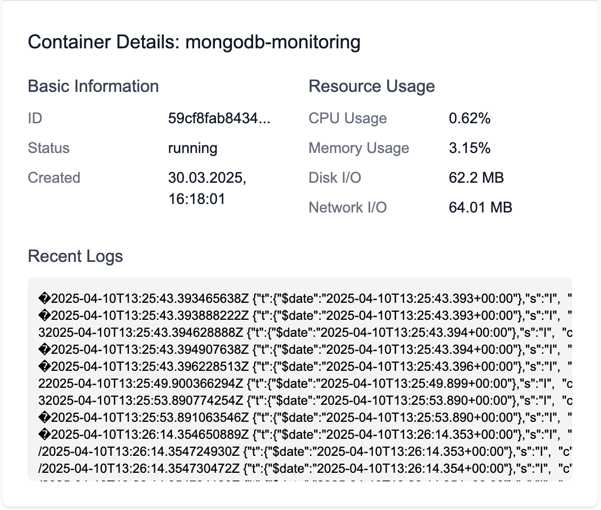

# Container Monitoring System

## 📄 Project Description

Container Monitoring System is a comprehensive solution that provides real-time Docker container performance statistics. The system collects, stores, and visualizes key performance metrics including CPU usage, RAM utilization, disk I/O operations, network activity, and logs. This full-stack application offers a clean, intuitive dashboard for monitoring and managing Docker containers with different access levels based on user roles.

## ✨ Features

### 📊 Monitoring Features:
- **Real-time Container Stats**: View live CPU, memory, disk I/O, and network usage metrics
- **Container Status**: Instantly see which containers are running, stopped, or in other states
- **Resource Visualization**: Interactive charts and graphs showing resource utilization
- **Container Logs**: Access the most recent logs directly from the dashboard
- **Historical Data**: Track performance metrics over time with customizable time ranges (hour/day/week)

### 👤 For Admin Users:
- **Force Data Refresh**: Manually trigger container data collection
- **Delete History**: Remove historical container data when needed
- **Full System Access**: Complete access to all containers and their metrics

### 👥 For Viewer Users:
- **Read-only Access**: View all container metrics and statistics
- **Historical Data Access**: Analyze performance trends over time
- **Container Details**: View detailed information about any container

### 🔐 Security Features:
- **Role-based Access Control**: Different permissions for admin and viewer roles
- **JWT Authentication**: Secure token-based authentication
- **Password Encryption**: Bcrypt hashing for secure password storage
- **Session Management**: Automatic handling of token expiration

## 🛠️ Technologies

### Backend:
- **Node.js**: JavaScript runtime environment
- **Express.js**: Web application framework
- **MongoDB**: NoSQL database for data storage
- **Mongoose**: MongoDB object modeling for Node.js
- **Dockerode**: Docker API Node.js library
- **JWT**: JSON Web Tokens for authentication
- **Bcrypt**: Password hashing library
- **Node-cron**: Task scheduler for periodic data collection

### Frontend:
- **Next.js**: React framework for building the UI
- **React**: JavaScript library for building user interfaces
- **Chart.js**: JavaScript charting library
- **Tailwind CSS**: Utility-first CSS framework
- **Axios**: Promise-based HTTP client
- **JWT-decode**: JWT token decoder

### Other:
- **Docker**: Containerization platform
- **Docker Compose**: Tool for defining multi-container Docker applications

## 🧬 Approximate Project Structure

```
container-monitoring-system/
├── src/
│   ├── api/                     # Backend API server
│   │   ├── controllers/         # API logic controllers
│   │   ├── middlewares/         # Express middlewares
│   │   ├── models/              # Mongoose data models
│   │   ├── routes/              # API route definitions
│   │   ├── server.js            # Main server file
│   │   └── package.json         # Backend dependencies
│   │
│   └── container-monitoring-dashboard/  # Frontend application
│       ├── app/                 # Next.js pages 
│       │   ├── auth/            # Authentication pages
│       │   ├── dashboard/       # Dashboard pages
│       ├── components/          # React components
│       │   ├── dashboard/       # Dashboard-specific components
│       │   └── layout/          # Layout components
│       ├── contexts/            # React contexts (auth)
│       ├── lib/                 # Utility functions
│       └── package.json         # Frontend dependencies
│
├── docker/                      # Docker configuration
│   └── docker-compose.yml       # Docker compose for MongoDB
│
└── README.md                    # Project documentation
```

## 📊 How It Works

1. **Data Collection**: The backend server connects to the Docker daemon using Dockerode to collect container statistics.
2. **Data Storage**: Container metrics are stored in MongoDB, both current state and historical data.
3. **Scheduled Collection**: A cron job runs every 15 seconds to refresh container data.
4. **API Access**: The REST API provides endpoints for retrieving container data, secured by JWT authentication.
5. **Visualization**: The Next.js frontend presents the data in an intuitive dashboard with interactive charts and tables.

## 🔒 Authentication

The system provides role-based access control:
- **Admin Users**: Can perform all operations including refreshing container data and deleting historical data.
- **Viewer Users**: Can view container statistics and historical data but cannot perform administrative actions.

To create an initial admin user, register a new user and manually update their role to "admin" in the MongoDB database.

## 🌐 API Endpoints

### Authentication
- `POST /api/auth/register` - Register a new user
- `POST /api/auth/login` - Authenticate and receive a JWT token

### Container Monitoring
- `GET /api/containers` - Get all container statistics
- `GET /api/containers/history` - Get container history with filters
- `POST /api/containers/refresh` - Force refresh container data (admin only)
- `DELETE /api/containers/delete-history` - Delete container history (admin only)

## 📷 Screenshots

The dashboard provides intuitive visualizations of container metrics:
- Container status overview with running/stopped containers
- Resource usage charts for CPU, RAM, memory and network utilization
- Detailed container information including logs
- Historical performance data with time range selection

### Login Page

Login panel for existing users to access the dashboard.

### Registration Page

Registration form for new users to create an account.

### Dashboard Overview

Main dashboard displaying container statistics and resource usage.

### Container Details

Detailed view of a specific container's metrics and logs.

### Historical Data

Charts showing historical performance data for selected containers.

## 👨‍💻 Author

- **MaksJanu** - [GitHub](https://github.com/MaksJanu)
